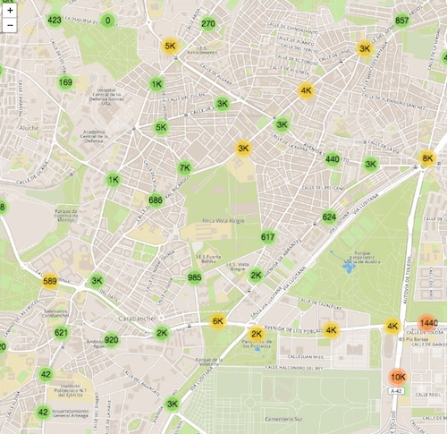

#Tráfico en Madrid

Visualización de tráfico en Madrid el 20 de Septiembre a las 17:22
Muestra el campo 'intensidad'

##Origen de datos 
Los datos han sido extraidos de http://datos.madrid.es
* [intensidad de tráfico](http://datos.madrid.es/portal/site/egob/menuitem.c05c1f754a33a9fbe4b2e4b284f1a5a0/?vgnextoid=02f2c23866b93410VgnVCM1000000b205a0aRCRD&vgnextchannel=374512b9ace9f310VgnVCM100000171f5a0aRCRD)

* [Ubicacion puntos medida](http://datos.madrid.es/portal/site/egob/menuitem.c05c1f754a33a9fbe4b2e4b284f1a5a0/?vgnextoid=ee941ce6ba6d3410VgnVCM1000000b205a0aRCRD&vgnextchannel=374512b9ace9f310VgnVCM100000171f5a0aRCRD&vgnextfmt=default)

##instalar
En este ejemplo se carga un fichero geojson externo lo que hace que se necesite un servidor para trabjar en local.

###opciones
* python 
`python -m SimpleHTTPServer` 
* [browser-sync](https://www.browsersync.io/) (recomendado)
 `browser-sync start --server --files "*,**/*"`