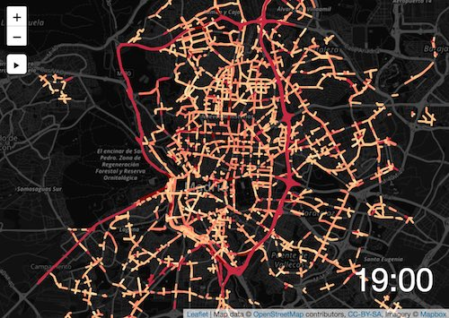

# Tráfico en Madrid

Visualización de densidad de tráfico en Madrid a lo largo de un día

## Origen de datos
Los datos han sido extraidos de http://datos.madrid.es
* [Intensidad del tráfico. Mapa de tramas](http://datos.madrid.es/sites/v/index.jsp?vgnextoid=23d57fa19bfa7410VgnVCM2000000c205a0aRCRD&vgnextchannel=374512b9ace9f310VgnVCM100000171f5a0aRCRD)

## instalar
En este ejemplo se carga un fichero geojson externo lo que hace que se necesite un servidor para trabjar en local.

### opciones
* python
`python -m SimpleHTTPServer`
* [browser-sync](https://www.browsersync.io/) (recomendado)
 `browser-sync start --server --files "*,**/*"`