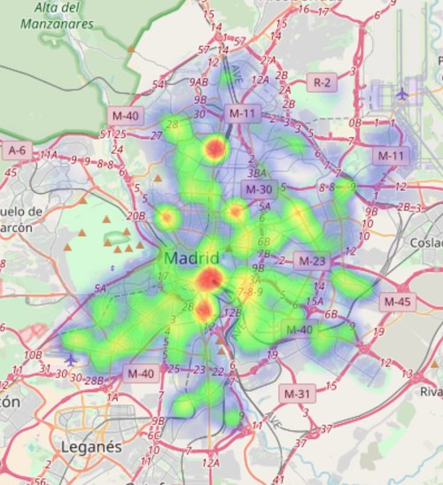

# Densidad viajeros EMT

Visualización de densidad de viajeros que suben a autobuses de la EMT a lo largo de un dia.

## Origen de datos
Los datos del paradas de EMt el 20 de Septiembre 2017 fué solicitado al [mobility lab EMT](https://mobilitylabs.emtmadrid.es/portal/)

## Procesamiento de datos 
El códigode la proceso está en este mismo repositorio en la carpeta /data/EMT